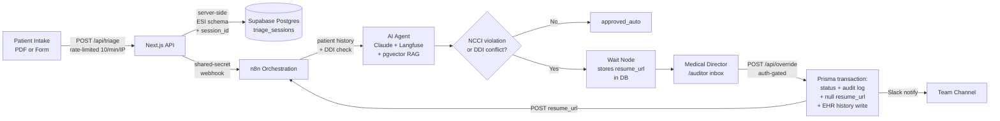

# Clinical Copilot — Guardrails-as-a-Service

A prototype of the part most clinical-AI demos skip: **the moment a doctor has to approve an AI decision.**

This is a working end-to-end pipeline for medication-conflict and clinical-billing triage with a Human-in-the-Loop (HITL) override flow. The interesting bits are not the AI — they are the security architecture, race-condition handling, audit trail, and server-side clinical-schema enforcement around the human approval step.

> **Status:** Working prototype. Multi-tenant DB schema with row-level security enforced at the Supabase layer; single-tenant UI. Hardcoded auth credentials for local development only — clearly marked as such and listed under "Not implemented yet."

---

## Why this exists

I'm a healthcare configuration analyst (SF Health Plan, 14+ years across QNXT, Epic Radiant, claims, regulatory compliance). Most AI prototypes I see in healthcare hand-wave the parts I spend my actual workdays on: who approved this, what they saw when they approved it, what happens if two people try to approve at the same time, how the audit trail survives if the orchestrator dies mid-flow, what happens when the schema the LLM returns doesn't match what the downstream actually needs.

This repo is my attempt to build the unglamorous half of a clinical AI workflow — correctly.

---

## Architecture



**Key invariant:** The Next.js layer makes **zero direct LLM calls.** All AI processing — Claude inference, RAG retrieval, Langfuse traces, NCCI/DDI rule checks — is isolated inside the n8n workflow. Verified by absence of `@anthropic-ai/sdk` and `langfuse` in the Next.js dependency graph.

---

## Two-page UI

| Route | Audience | What it does |
| --- | --- | --- |
| `/` | Physician | Triage intake form + PDF upload, AI result panel, HITL override controls with required justification |
| `/auditor` | Medical Director | Inbox of pending overrides with full clinical context (AI reasoning, CPT codes, ICD-10 codes); Approve/Deny actions; ≥5-character resolution note required |

---

## What's interesting in this codebase

### 1. The `resume_url` is never returned to the frontend

When n8n hits a Wait node (because the AI flagged a medication conflict or NCCI violation), it stores a `resume_url` token in the `triage_sessions` row. This token is the URL that thaws the n8n pipeline. If the client had it, a malicious user could approve themselves.

So:

- The frontend never sees `resume_url`. Not in any API response. Not even commented out.
- `/api/override` fetches it directly from Postgres using `session_id`.
- The Prisma transaction nulls the token in the same atomic write that approves the session.

### 2. Optimistic concurrency on physician approval

Two physicians clicking "approve" at the same time would be a real production bug. Handled via:

```ts
await prisma.triage_sessions.updateMany({
  where: { id: session_id, status: 'processing' },  // guard on current status
  data:  { status: 'approved_by_doctor' },
});
// If count === 0, another physician already approved. Return 409.
```

`updateMany` returns `{ count }`. If `count === 0`, the row was already moved by someone else and the API returns `RACE_CONDITION` 409.

### 3. `physician_id` is sourced from the server-side NextAuth session

Never from the client payload. If the client sent it, you could spoof another physician's approval. Same principle for the auditor inbox — every approve/deny action carries the session-derived identity to the audit log.

### 4. Multi-tenant schema, single-tenant UI

The Postgres schema is multi-tenant — `triage_sessions`, `clinical_alerts`, and `audit_logs` all carry `tenant_id` foreign keys to a `tenants` table, with **row-level security policies enforced at the Supabase database layer**. The UI is currently single-tenant prototype with one hardcoded `tenant_id`. **I'm honest about this in the code and in this README** rather than claiming a feature I haven't shipped.

### 5. Immutable audit log inside the same transaction

The `audit_logs` insert, the `triage_sessions` status update, the resume-token nulling, and the EHR `patient_history` write all happen inside a single `prisma.$transaction`. If any step fails, all roll back. No "approved but no audit record" state is structurally possible.

### 6. ESI clinical schema is enforced server-side

The triage intake API (`/api/triage`) defines a strict JSON schema for what n8n's clinical AI is allowed to return — required `esi_level` (acuity 1–5), required `proposed_cpt` (array), and an explicit rule that `requires_hitl` MUST be `true` if ESI is 1 or 2. The schema is built on the server and injected into the n8n payload. The client cannot manipulate the clinical contract by tampering with the request — the contract is defined where the trust boundary actually sits.

---

## Stack

| Layer | Tech |
| --- | --- |
| Frontend + API | Next.js 16 (App Router), TypeScript, React 19, Tailwind CSS 4 |
| Auth | NextAuth 4.24 (CredentialsProvider, JWT sessions) |
| ORM | Prisma 6.19 |
| Database | PostgreSQL + pgvector on Supabase (row-level security at the DB layer) |
| PDF parsing | `pdf2json` (server-side) |
| AI orchestration | n8n (external) |
| AI/LLM stack | Anthropic Claude + Langfuse observability + Postgres chat memory + Ollama embeddings + pgvector RAG — **all inside n8n**, not in the Next.js dependency graph |
| Notifications | Slack (via n8n) |

---

## API surface

| Route | Method | What it does |
| --- | --- | --- |
| `/api/triage` | POST | Rate-limited (10 req/min per IP). Generates `session_id` via `crypto.randomUUID()`, builds and injects the server-side ESI clinical schema, fires the n8n webhook with a shared-secret header |
| `/api/upload` | POST | Accepts multipart PDF, parses with `pdf2json` server-side, returns extracted text |
| `/api/override` | POST | Auth-gated. Fetches `resume_url` from DB by `session_id`, runs Prisma transaction (status update + audit log + token nulling + EHR history write), then POSTs to n8n to thaw the pipeline. Concurrency-safe via `updateMany` status check → 409 on race |
| `/api/ledger` | GET / PATCH | Auth-gated. GET lists flagged sessions for the auditor inbox; PATCH records the director's resolution state |
| `/api/patient` | GET | EHR lookup by MRN: checks mock DB first, then `patient_history`; auto-registers net-new patients on first visit |
| `/api/history` | POST | Auth-gated. Writes auto-approved sessions to `patient_history` (HPI + ICD-10 codes) |
| `/api/auth/[...nextauth]` | GET / POST | NextAuth credential handler |

---

## n8n orchestration overview

The n8n workflow is external and not committed to this repo. At a high level it executes:

1. **Inbound webhook** — receives triage payload + ESI schema from `/api/triage`
2. **Patient history lookup** against Supabase
3. **Deterministic DDI check** — drug-drug interaction lookup via SQL
4. **AI Agent** — Anthropic Claude with Langfuse observability, Postgres chat memory, and Ollama-embedded pgvector RAG over `clinic_guidelines`
5. **NCCI violation router** — bundling-rule check on the AI's proposed CPT codes
6. **HITL gate** — on conflict, stores `resume_url` in `triage_sessions`, waits for physician approval via `/api/override`
7. **Slack notification** on HITL events
8. **Session expiration job** — auto-expires triage sessions past `expires_at`

---

## Architecture invariants (do not break)

1. Next.js makes **no direct LLM calls** — all AI processing is in n8n.
2. `resume_url` is **never returned to the frontend** under any circumstances.
3. All override approvals must go through `/api/override`, never direct n8n calls from the client.
4. `physician_id` and director identity must always come from the server-side session, never client payload.
5. The DB schema is multi-tenant but the UI is single-tenant prototype — do not conflate the two.
6. The ESI clinical schema is defined server-side and injected into the n8n payload — clients cannot manipulate it.

---

## Prisma schema (8 models)

`agent_memory`, `audit_logs` (RLS), `clinic_guidelines` (with pgvector embedding column), `clinical_alerts` (RLS), `patient_history`, `patient_intake`, `tenants`, `triage_sessions` (RLS). Full schema in [`prisma/schema.prisma`](./prisma/schema.prisma).

---

## What is NOT implemented yet

Being honest about the gap between prototype and production:

- Real authentication (provider login, role-based access, multi-physician sessions).
- Secrets management — currently env vars and hardcoded prototype creds in `lib/authOptions.ts`.
- Tenant-switching UI.
- `clinic_guidelines` RAG wired through to the frontend (schema and embeddings exist; UI surfacing does not).
- Automated tests — no unit, integration, or e2e tests exist.
- CI/CD pipeline.
- HMAC inbound webhook verification — only outbound shared-secret today.
- Full PATCH body validation on `/api/ledger` — unexpected `action` values silently default to "Denied".
- Rate limiting on `/api/override`.
- PHI scrubbing in application logs.

The n8n workflow is external and would need to be exported and committed before any third party could run the full system end-to-end.

---

## Prototype credentials

For local exploration only. Hardcoded credentials live in `lib/authOptions.ts` — clone the repo and read the file to find them. These are flagged above in "Not implemented yet" as a known production gap.

---

## Related files in this repo

- [`state.md`](./state.md) — development log of what was built and when
- [`CLAUDE.md`](./CLAUDE.md) — AI-agent behavioral constitution I use with Claude Code (no sycophancy, scope discipline, verification before "done", explicit reversion declaration) plus accumulated project learnings

---

## About me

Sukrit Chakravarty — Senior Configuration Analyst at SF Health Plan, transitioning to Healthcare AI Workflow Architect. 14+ years of QNXT configuration, claims adjudication, provider contracting, and Medi-Cal / Medicare / DSNP regulatory work. I'm building the AI tools I wish existed for my own daily workflow.

[LinkedIn](https://linkedin.com/in/sukrit-chakravarty-549016156)