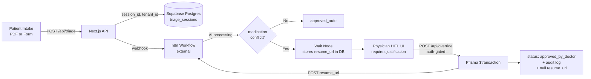

# Clinical Copilot — Guardrails-as-a-Service

A prototype of the part most clinical-AI demos skip: **the moment a doctor has to approve an AI decision.**

This is a working end-to-end pipeline for medication-conflict triage with a Human-in-the-Loop (HITL) override flow. The interesting bits are not the AI — they are the security architecture, race-condition handling, and audit trail around the human approval step.

> **Status:** Working prototype. Single-tenant UI, multi-tenant DB schema. Hardcoded auth credentials for demo purposes — not production.

---

## Why this exists

I'm a healthcare configuration analyst (SF Health Plan, 14+ years across QNXT, Epic Radiant, claims, regulatory compliance). Most AI prototypes I see in healthcare hand-wave the parts I spend my actual workdays on: who approved this, what they saw when they approved it, what happens if two people try to approve at the same time, how the audit trail survives if the orchestrator dies mid-flow.

This repo is my attempt to build the unglamorous half of a clinical AI workflow — correctly.

---

## Architecture



**Key invariant:** The Next.js layer makes **zero direct LLM calls.** All AI processing is isolated inside the n8n workflow. The frontend is dumb on purpose.

---

## What's interesting in this codebase

### 1. The `resume_url` is never returned to the frontend

When n8n hits a Wait node (because the AI flagged a medication conflict), it stores a `resume_url` token in the `triage_sessions` row. This token is the URL that thaws the n8n pipeline. If the client had it, a malicious user could approve themselves.

So:
- The frontend never sees `resume_url`. Not in any API response. Not even commented out.
- `/api/override` fetches it directly from Postgres using `session_id`.
- The Prisma transaction nulls the token in the same atomic write that approves the session.

### 2. Optimistic concurrency on physician approval

Two physicians clicking "approve" at the same time would be a real production bug. Handled via:

```ts
await prisma.triage_sessions.updateMany({
  where: { id: session_id, status: 'processing' },  // guard on current status
  data:  { status: 'approved_by_doctor' },
});
// If count === 0, another physician already approved. Return 409.
```

`updateMany` returns `{ count }`. If `count === 0`, the row was already moved by someone else and the API returns `RACE_CONDITION` 409.

### 3. `physician_id` is sourced from the server-side NextAuth session

Never from the client payload. If the client sent it, you could spoof another physician's approval. This is the kind of thing that's obvious once you've worked on a real audit-logged system.

### 4. Multi-tenant schema, single-tenant UI

The Postgres schema is fully multi-tenant — `triage_sessions`, `clinical_alerts`, `audit_logs` all carry `tenant_id` foreign keys to a `tenants` table, with RLS markers. The UI is currently single-tenant prototype with one hardcoded `tenant_id`. **I'm honest about this in the code and in this README** rather than claiming a feature I haven't shipped.

### 5. Immutable audit log inside the same transaction

The `audit_logs` insert and the `triage_sessions` status update happen inside a single `prisma.$transaction`. If either fails, both roll back. No "approved but no audit record" state is possible.

---

## Stack

| Layer | Tech |
|---|---|
| Frontend + API | Next.js 16 (App Router), TypeScript, Tailwind CSS 4 |
| ORM | Prisma |
| Database | PostgreSQL + pgvector on Supabase |
| Auth | NextAuth (CredentialsProvider, JWT sessions) |
| AI orchestration | n8n (external, not in this repo) |
| PDF parsing | `pdf2json` (server-side) |

The n8n workflow itself is not committed here. All AI/model routing and any RAG logic lives inside n8n. The Next.js layer treats it as an opaque webhook.

---

## API surface

| Route | Method | What it does |
| --- | --- | --- |
| `/api/triage` | POST | Validates patient data, generates `session_id` server-side via `crypto.randomUUID()`, fires n8n webhook |
| `/api/upload` | POST | Accepts PDF via multipart form, parses with `pdf2json` server-side, returns raw text |
| `/api/override` | POST | Auth-gated. Fetches `resume_url` from DB, runs Prisma transaction (status update + audit log + token nulling), then POSTs to n8n to thaw the pipeline |
| `/api/auth/[...nextauth]` | GET/POST | NextAuth credential provider handler |

---

## Architecture invariants (do not break)

1. Next.js makes **no direct LLM calls** — all AI processing is in n8n.
2. `resume_url` is **never returned to the frontend** under any circumstances.
3. All override approvals must go through `/api/override`, never direct n8n calls from the client.
4. `physician_id` must always come from the server-side session, never client payload.
5. The DB schema is multi-tenant but the UI is single-tenant prototype — do not conflate the two.

---

## What is NOT implemented yet

Being honest about the gap between prototype and production:

- Real authentication (provider login, role-based access, multi-physician)
- Secrets management (currently env vars and hardcoded prototype creds)
- Tenant-switching UI
- `clinic_guidelines` RAG wired to the frontend (schema is ready, UI is not)
- Automated tests (unit, integration)
- CI/CD pipeline
- Rate limiting on `/api/override`
- PHI scrubbing in application logs

The n8n workflow is external and not in this repo.

---

## Prototype credentials

For local exploration only:

- Username: `dr_house`
- Password: `medconflict123`

These are hardcoded in `lib/authOptions.ts` and clearly marked as prototype-only. Real auth is in the "not implemented yet" list above.

---

## Demo

[Inference: replace these with your real links once you have them]

- **Video walkthrough:** [LinkedIn post link]
- **Architecture diagrams:** [LinkedIn post link]
- **Screenshots:** see `docs/screenshots/` (if you commit them)

---

## Related files in this repo

- [`state.md`](./state.md) — development log of what was built and when
- [`CLAUDE.md`](./CLAUDE.md) — AI-agent behavioral constitution I use with Claude Code (no sycophancy, scope discipline, verification before "done") plus accumulated project learnings

---

## About me

Sukrit Chakravarty — Senior Configuration Analyst at SF Health Plan, transitioning to Healthcare AI Workflow Architect. 14+ years of QNXT, claims adjudication, provider contracting, and Medi-Cal/Medicare/DSNP regulatory work. I'm building the AI tools I wish existed for my own daily workflow.

[LinkedIn](https://linkedin.com/in/sukrit-chakravarty-549016156)
